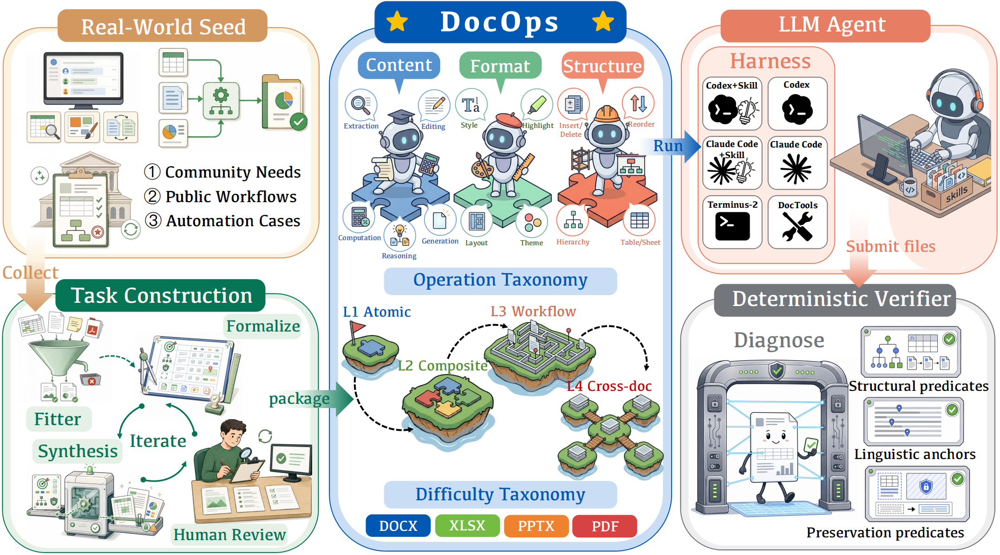

# DocOps

DocOps is a Harbor-formatted benchmark for evaluating document-operation
agents across Excel, Word, PowerPoint, and PDF files. Unlike document QA
benchmarks that mainly inspect textual answers, DocOps evaluates whether an
agent can edit native documents into the requested state while preserving
format validity, document structure, formulas, styles, outlines, bookmarks, and
other task-relevant out-of-scope state.

This repository contains the complete 210-task release, deterministic verifiers,
execution harness wrappers, document-operation skills, and Docker base images
needed to reproduce the benchmark runs.

<p align="center">
  
</p>

## What's Included

- 210 Harbor tasks in `tasks/`.
- Four document formats: Excel, Word, PowerPoint, and PDF.
- Four difficulty levels:
  - L1: localized atomic operations, 50 tasks.
  - L2: compositional same-document operations, 40 tasks.
  - L3: single-document workflows, 60 tasks.
  - L4: cross-document workflows, 60 tasks.
- Deterministic artifact-level verifiers under each task's `tests/` directory.
- Shared document-operation skills for skill-enabled Codex and Claude Code runs.
- Harness wrappers for DocumentTools, Terminus-2, Codex, and Claude Code.
- Prebuilt Harbor Docker base images for the supported Docker profiles.

## Repository Layout

```text
.
|-- tasks/                 # Complete 210 Harbor task directories
|-- skills/                # Shared document-operation skills
|-- harnesses/             # Custom harness code, including DocumentTools
|-- scripts/               # Setup, validation, manifest, and run scripts
|-- docker/                # Prebuilt Harbor base images and load script
|-- third_party/harbor/    # Vendored Harbor runner source
|-- metadata/              # Generated task manifests
|-- results/               # Default run outputs; ignored by git
`-- runtime/               # Generated no-skill task materializations; ignored by git
```

Each task follows the Harbor task format:

```text
task_name/
|-- instruction.md
|-- task.toml
|-- environment/
|   |-- Dockerfile
|   |-- task_metadata.json
|   `-- input documents
`-- tests/
    |-- test.sh
    |-- test_outputs.py
    `-- verifier utilities
```

## Quick Start

### 1. Install Python Dependencies

DocOps uses Harbor as the execution runner. Python 3.12 or newer is
recommended.

```bash
python3.12 -m venv .venv
source .venv/bin/activate
python -m pip install --upgrade pip
python -m pip install -r requirements.txt
```

You can also use the helper script:

```bash
./scripts/setup_env.sh
```

### 2. Load Docker Base Images

DocOps task Dockerfiles depend on two Harbor base image tags:

```text
harbor-claude-code-base:2.1.114
harbor-codex-base:2.1.114
```

This release provides two image profiles under `docker/images/`:

```text
docker/images/x86/    # Server profile observed on a800-1
docker/images/amd/    # Generic AMD64 profile
```

Use the `x86` profile on the x86_64 Linux server setup:

```bash
./docker/load_images.sh x86
```

Use the `amd` profile for a generic AMD64 Docker environment:

```bash
./docker/load_images.sh amd
```

The naming is profile-based. At the Docker platform level, both bundled image
sets are Linux containers for the x86_64/amd64 CPU family. ARM64 requires a
separate exported image set.

For Codex runs against self-hosted models served through vLLM or another
OpenAI-compatible endpoint, we recommend the `x86` profile. It uses the Codex
0.80 chat base image observed in the server runs and automatically tags it as
`harbor-codex-base:2.1.114` so existing task Dockerfiles remain unchanged.

### 3. Configure API Credentials

Create a local environment file:

```bash
cp .env.example .env
```

Then fill in only the fields required by the harness you plan to run.

For OpenAI-compatible models:

```bash
OPENAI_API_KEY=your_key
OPENAI_BASE_URL=http://host:port/v1
DOCOPS_DOCTOOLS_MODEL=openai/served-model-name
DOCOPS_TERMINUS2_MODEL=openai/served-model-name
DOCOPS_CODEX_MODEL=served-model-name
```

For Claude Code:

```bash
ANTHROPIC_BASE_URL=https://your-anthropic-compatible-endpoint
ANTHROPIC_AUTH_TOKEN=your_key
DOCOPS_CLAUDE_MODEL=claude-sonnet-4-6
```

Credentials and run outputs are ignored by git.

## Self-Hosted vLLM

For local or server-side open-weight model evaluation, serve the model with an
OpenAI-compatible vLLM endpoint, for example:

```bash
vllm serve /path/to/model \
  --host 0.0.0.0 \
  --port 8000 \
  --served-model-name served-model-name \
  --tensor-parallel-size 8 \
  --enable-prefix-caching \
  --enable-chunked-prefill \
  --gpu-memory-utilization 0.90
```

Then point DocOps to the endpoint in `.env`:

```bash
OPENAI_API_KEY=dummy
OPENAI_BASE_URL=http://server:8000/v1
DOCOPS_CODEX_MODEL=served-model-name
```

For Codex with vLLM-hosted models, load the `x86` image profile:

```bash
./docker/load_images.sh x86
```

## Run the Benchmark

Run DocumentTools:

```bash
./scripts/run_doctools.sh
```

Run Terminus-2:

```bash
./scripts/run_terminus2.sh
```

Run Codex:

```bash
./scripts/run_codex_with_skill.sh
./scripts/run_codex_no_skill.sh
```

Run Claude Code:

```bash
./scripts/run_claude_code_with_skill.sh
./scripts/run_claude_code_no_skill.sh
```

All wrapper scripts call the unified runner:

```bash
./scripts/run_harness.sh codex --skill on
./scripts/run_harness.sh codex --skill off
./scripts/run_harness.sh claude-code --skill on
./scripts/run_harness.sh claude-code --skill off
./scripts/run_harness.sh terminus2
./scripts/run_harness.sh doctools
```

## Skills and No-Skill Runs

Skill-enabled runs use the task directories in `tasks/` directly. These tasks
copy `environment/skills/` into common agent skill locations inside the
container.

No-skill runs are materialized under:

```text
runtime/no_skill_tasks/
```

The materialization step removes skill references from `task.toml`,
`instruction.md`, task Dockerfiles, and per-task `environment/skills/`
directories. This keeps skill-on and skill-off settings comparable while
preserving the same task inputs and verifiers.

## Outputs

By default, runs are written under `results/`. Harbor stores task-level logs,
agent outputs, verifier outputs, and result metadata in the selected output
directory.

The default run controls are configured in `.env`:

```bash
HARBOR_RUN_COUNT=1
HARBOR_N_CONCURRENT=1
DOCOPS_OUTPUT_ROOT=results
```

Increase concurrency only after confirming that the selected model endpoint and
Docker host can handle the workload.
